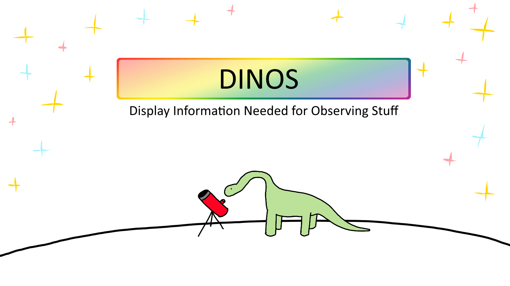

# dinos
Display Information Needed for Observing Stuff


Have you ever tried getting ready for an observing run, and found yourself with 500+ browser tabs trying to get finding charts and rise and set times and airmass plots for your targets, and wanted to quit academia to go live in the woods because it was such a hassle? Well look no further because DINOS is the one more browser tab you need to finally make finding your finding charts easy!

The idea is this: put the names of your targets in a config file, run a python command, enjoy your nicely formatted PDF with all the information you need to observing stuff.

(as per [this](https://xkcd.com/927/) you probably will still need more than just DINOS to get *all* the information you need. But DINOS ought to help reduce the clutter)

# Quick-Start

Steps for DINOS-ing:
- Make a configuration `json` file
- Run the command `python dinos.py -i example_config.json -o example_output` where `-i` specifies the configuration file you just made, and `-o` specifies the output directory.
- Your PDF will be inside your output directory as `dinos_report.pdf`

If all goes well you should see something like the following:

```
  _____ _____ _   _  ____   _____        __ 
 |  __ \_   _| \ | |/ __ \ / ____|      /_ |
 | |  | || | |  \| | |  | | (___   __   _| |
 | |  | || | | . ` | |  | |\___ \  \ \ / / |
 | |__| || |_| |\  | |__| |____) |  \ V /| |
 |_____/_____|_| \_|\____/|_____/    \_/ |_|
                                            
It's dino time

reading configuration...
defining observer...
setting up times...
setting up targets...
creating plots...
all sky map
local sky map
airmass
Finder image NGC6302
Finder image M102
Finder image Vega
formatting document...
This is pdfTeX, Version 3.14159265-2.6-1.40.18 (TeX Live 2017/Debian) (preloaded format=pdflatex)
 restricted \write18 enabled.
entering extended mode
Done!
```

# Making Your Config File

But what should this configuration file look like? An `example_config.json` is provided. Here I will step through it.

There are three main parts to the configuration file: `Night`, `Targets`, and `Config`.


`Night` contains the information about the observing night. Example:

```json
"Night":{
    "telescope_name":"Nordic Optical Telescope",
    "observer_lat":-17.884999999999998,
    "observer_long":28.7569444,
    "observer_elevation":2383,
    "observer_timezone":"GMT"
    "obs_start":"2023-08-07 21:26:00",
    "obs_end":"2023-08-08 05:10:00",
    "block_start_times":[
        "2023-08-07 21:30:00",
        "2023-08-07 23:25:00",
        "2023-08-08 01:20:00",
        "2023-08-08 03:15:00"
    ],
    "block_end_times":[
        "2023-08-07 23:25:00",
        "2023-08-08 01:20:00",
        "2023-08-08 03:15:00",
        "2023-08-08 05:10:00"            
    ],
    "block_colors":[
        "xkcd:green",
        "xkcd:blue",
        "xkcd:red",
        "xkcd:orange"
    ]
}
```

- `telescope_name` defines the name of your observer. DINOS supports automatic observer setup for specific names. That is to say that with certain telescope names, DINOS does not need you to specify anything for the `observer_lat`, `observer_long`, `observer_elevation`, or `observer_timezone` parameters. The automatic names are "Aarhus" for the city of Aarhus, Denmark, and "NOT" or "Nordic Optical Telescope" for the thusly named telescope in La Palma, Spain.

- `block_start_times` defines the observing blocks you have, if any. Observing blocks are plotted on the airmass diagram to help you understand when different targets are best observed. If you leave this blank DINOS will not use any observing blocks.

- `block_end_times` defines the ending times of your blocks. If you leave this blank but do have blocks defined with `block_start_times`, each block will just end when the next one begins.

- `block_colors` defines custom colors for your blocks. They must be colors that can be displayed by matplotlib. If this is blank, DINOS will give your blocks colors automatically.

`Targets` contains information about the targets. Example:

```json
"Targets":[
        "NGC6302",
        "M102",
        "Vega"
    ],
```

Under `Targets`, you just list the names of the targets you want. As long as they can be resolved by [SIMBAD](https://simbad.cds.unistra.fr/simbad/sim-fbasic), you shouldn't see any errors. You can also specify your own coordinates. The format for that is `RA DEC name`. For example:

```json
"Targets":[
        "250d25m24.51s 36d27m40.75s M13",
        "250d19m24.51s 36d27m40.75s M13b",
        "250d31m24.51s 36d27m40.75s M13c",
        "250d25m24.51s 36d21m40.75s M13d",
        "250d25m24.51s 36d33m40.75s M13e"
    ],
```

This sets up several "targets" around the globular cluster M13. This example might be what you would use if you wanted to make a mosaic image of an object that is bigger than your telescope's field of view. Each line here lists the RA and DEC, with a unique name. All of these are for M13, but require different names because DINOS saves finding charts as "finder_name.jpg" and duplicate names will overwrite finder charts, leading to repeated finder charts in the final document. Names like "M13b" are not resolveable by SIMBAD and will throw an error, but DINOS will continue just with the coordinates you specified.

- `Config`, which contains arguments for the different plotting functions. Example:

```json
"Config":{
        "PDF":{
            "theme":"light"
        },
        "all_sky_map":{
            "do_stars":true,
            "do_asterisms":true,
            "do_constellations":false,
            "do_moon":true,
            "move_moon":false,
            "do_time_text":false,
            "do_xticks":false,
            "do_yticks":true,
            "do_title":false,
            "do_legend":false,
            "do_target_colors":true,
            "do_obs_lines":false,
            "mag_limit":8.5,
            "star_marker":"o",
            "target_marker":"*",
            "sky_culture":"rey"
            
        },
        "local_sky":{
            "do_moon":false,
            "do_grid":true
        },
        "airmass":{
            "do_moon":true,
            "do_moon_labels":true
        },
        "finder_images":{
            "survey":"DSS",
            "fov_radius":3.2
            "log":false,
            "grid":false,
            "reticle":true
        }
    }
```

There are several subsections here, for different functions.

The first subsection `PDF` is not implimented yet. In the future there will be options to change the theme of the output PDF here.

The next subsection is `all_sky_map`. It configures the appearance of the all sky map in the report. Its parameters are as follows:

- `do_stars` enables or disables the stars in the plot. It should be a boolean value, true or false.

- `do_asterisms` enables or disables the asterisms, i.e. the lines between the stars in constellations. It should be a boolean value, true or false.

- `do_constellations` enables or disables the constellations, i.e. the bounderies of the areas on the sky associated with each constellation. It should be a boolean value, true or false.

- `do_moon` enables or disables overplotting the moon on the map. The moon will be plotted at the start of the observing window, unless `move_moon` is true, in which case the location of the moon will be plotted at several epochs during the observing window. It should be a boolean value, true or false.

- `move_moon` enables or disables plotting the moon at several epochs during the observing window. It should be a boolean value, true or false.

- `do_time_text` enables or disables writing the time assocated with each displayed moving target. For example, if `move_moon` and `do_time_text` are both enabled, there will be text next to each image of the moon stating at what time during the observing run the moon will be at that location. This also works for other objects which do not have well-defined RA and DECs, such as planets or satellites. It should be a boolean value, true or false.

- `do_xticks` enables or disables x axis (right ascension) labels. It should be a boolean value, true or false.

- `do_yticks` enables or disables y axis (declination) labels. It should be a boolean value, true or false.

- `do_title` enables or disables displaying the figure title directly on the figure. This is not useful for the report PDF, because the page associated with the all sky map already has its own title. But if you are not interested in the PDF and want this map as a standalone figure, which DINOS does produce and saves in the output folder, enabling the title directly on the plot may make sense. It should be a boolean value, true or false.

- `do_legend` enables or disables the legend for the figure. It should be a boolean value, true or false.

- `do_target_colors` enables or disables using the report-wide colors given to each target, just for this plot. If disabled, all targets will be plotted in white. It should be a boolean value, true or false.

- `do_obs_lines` enables or disables plotting lines on the map which represent the observable part of the sky at the beginning and end of the observing window. It should be a boolean value, true or false.

- `mag_limit` sets the limiting magnitude for plotting the stars if `do_stars` is true. Note that at higher values, i.e. enabling plotting fainter stars, the number of stars that are plotted grows dramatically and this can have a serious performance penalty. Additionally, because stars are plotted with transparency based on their magnitude, `mag_limit` values above 9 will have diminishing returns with fainter stars not being very visible on the plot. It is recommended to keep this value at or below 8.5, which is a nice middle ground between performance and visual quality.

- `star_marker` changes the way matplotlib will dislpay the background stars on the map. It should be the same as a matplotlib marker style.

- `target_marker` changes the way matplotlib will display your targets on the map. It should be the same as a matplotlib marker style.

- `sky_culture` changes they way the constellations and asterisms are displayed. Currently only the "rey" sky culture is supported, which displays the constellations as defined in H.A. Rey's book "The Stars: A New Way To See Them".


The next subsection is `local_sky`. It configures the local sky plot, which shows how objects will move across the sky from the perspective of the observer. It has two parameters:

- `do_moon` enables or disables plotting the moon on the chart. It should be a boolean value, true or false.

- `do_grid` enables or disables plotting an altitude-azimuth grid on the chart. It should be a boolean value, true or false.

The next subsection is `airmass`. It configures the airmass-altitude plot. It has two parameters:

- `do_moon` enables or disables plotting the moon on the chart. It should be a boolean value, true or false.

- `do_moon_labels` enables or disables plotting the angular separation between your targets and the moon on the chart. If you have many targets, keeping this enabled may cause significant visual clutter. It should be a boolean value, true or false.

The next subsection is `finder_images`. It configures the finder images created for each object. It is heavily based on astroplan's finder image functions and takes the following parameters:

- `survey` specifies the sky survey used for the finding charts.

- `fov_radius` defines the radius of the finding chart in arcminutes. The default is 3.2, which corresponds to the field of view of the Nordic Optical Telescope.

- `log` takes the natural logarithm of the finder chart image. This can be useful if the field has both faint and bright objects, and you want to be able to see the faint ones. It should be a boolean value, true or false.

- `reticle` enables or disables plotting a reticle directly around your target. The reticle will be in the color of your target as defined automatically for the report PDF. It is highly recommended you keep this on, as that is the entire point of having a finding chart. But maybe if you have an extended object you don't want it for the sake of clutter. You do you. It should be a boolean value, true or false.


# Requirements

DINOS requires python 3.10 or higher, as well as the following python packages:

-`cartopy`
-`astropy`
-`astroplan`
-`astroquery`
-`pandas`
-`numpy`
-`matplotlib`
-`seaborn`
-`shutil`
-`datetime`


Additionally, DINOS requires pdflatex. If you are using linux, you can install it by following [these](https://gist.github.com/rain1024/98dd5e2c6c8c28f9ea9d) instructions.